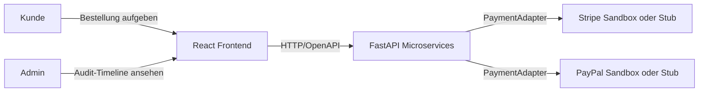
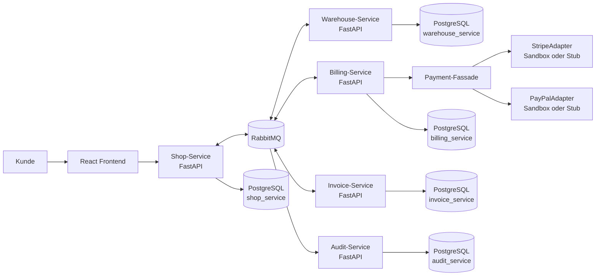
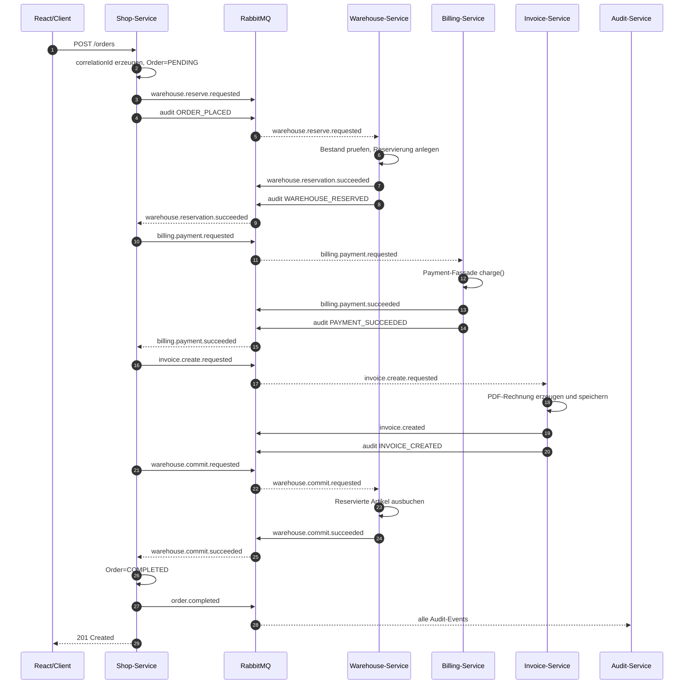
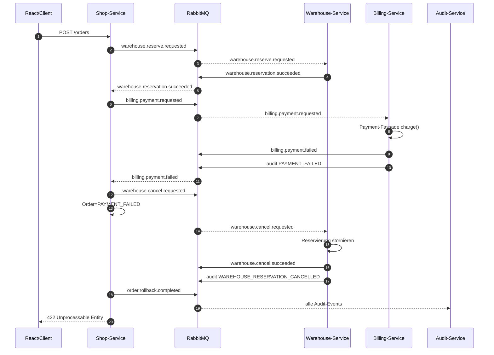

# Architektur: Microservice-orientierter Online-Shop

## 1. Zielbild

Das System simuliert den Bestellprozess eines Online-Shops mit klar getrennten
Microservices. Die Umsetzung nutzt Python/FastAPI fuer die Backend-Services,
React fuer Shop und Admin-Dashboard, PostgreSQL fuer Persistenz, RabbitMQ
fuer interne Service-Kommunikation und Docker Compose fuer das lokale Deployment.

Die interne Kommunikation wird bewusst event- und command-basiert ueber RabbitMQ
geplant. Damit weicht das Projekt von der Aufgabenblatt-Empfehlung ab, Shop zu
Warehouse und Billing synchron per REST aufzurufen. Diese Entscheidung ist in
`docs/decisions/002-rabbitmq-for-service-communication.md` begruendet.

## 2. Systemkontext



## 3. Komponenten



### Verantwortlichkeiten

| Komponente | Verantwortlichkeit |
| --- | --- |
| React Frontend | Externe UI fuer Bestellung und Admin-Dashboard |
| Shop-Service | Externe Order API, Produktkatalog, correlationId, Order-Status, Saga-Orchestrierung; DB `shop_service` |
| Warehouse-Service | Bestand pruefen, Reservierung anlegen, stornieren und final ausbuchen; DB `warehouse_service` vorbereitet |
| Billing-Service | Zahlungsfluss, Payment-Fassade, Checkout-Sessions, Refunds; DB `billing_service` vorbereitet |
| Invoice-Service | PDF-Rechnungserstellung, persistente Invoice-Metadaten und Retry-Mechanismus; DB `invoice_service` |
| Audit-Service | Unveraenderliche Audit-Snapshots chronologisch bereitstellen; DB `audit_service` |
| RabbitMQ | Commands und Domain-Events zwischen Services |
| PostgreSQL | Persistenz pro Service, mindestens Audit-Snapshot-Speicher |

## 4. Kommunikationsmodell

Externe Clients sprechen REST/OpenAPI mit dem Shop-Service und Audit-Service.
Interne Service-Kommunikation laeuft ueber RabbitMQ. Commands fordern Arbeit an,
Events beschreiben ein bereits eingetretenes Ergebnis.

Alle Messages verwenden ein gemeinsames Envelope:

```json
{
  "messageId": "3ed57c11-faa8-4e8e-bb4c-4c7c1e6cbb7b",
  "correlationId": "65c40581-4e0d-4a7f-8e9e-0c79fe412c73",
  "type": "billing.payment.succeeded",
  "sourceService": "billing-service",
  "timestamp": "2026-07-07T15:30:00Z",
  "payload": {},
  "previousEventId": "0f394842-96e6-48d8-a4fe-7d0a2a49b17c"
}
```

Die verbindlichen Routing Keys sind in `docs/event-contracts.md` dokumentiert.

## 5. Happy Path



## 6. Fehlerszenario: Zahlung abgelehnt



## 7. Payment-Fassade

Der Billing-Service kapselt alle Zahlungsanbieter hinter einer gemeinsamen
Fassade. Der Billing-Kern arbeitet nur mit eigenen Domaenentypen und kennt keine
anbieter-spezifischen Payloads. Stripe und PayPal koennen gegen echte Sandboxen
laufen, fallen ohne Credentials aber auf lokale Stub-Antworten zurueck.

Pflichtoperationen:

- `charge(orderId, amount, currency)`
- `refund(transactionId, amount)`
- `getStatus(transactionId)`

Anbieter:

- `StripeAdapter`
- `PayPalAdapter`

Der aktive Anbieter wird per Konfiguration gesetzt, zum Beispiel
`PAYMENT_PROVIDER=stripe` oder `PAYMENT_PROVIDER=paypal`.

Adapter registrieren sich automatisch ueber die Basisklasse `PaymentAdapter`.
Ein weiterer Anbieter wird als neue Adapterklasse mit eigenem `provider_name`
hinzugefuegt; die Fassade selbst muss dafuer nicht geaendert werden.

### API- und Fehlerkonventionen

Alle Services liefern technische Fehler als RFC-7807-kompatible
`application/problem+json`-Antworten. Die Antwort enthaelt `type`, `title`,
`status`, `detail`, `instance` und die aktuelle `correlationId`.

### Idempotenz fuer POST /orders

Der Shop-Service unterstuetzt den Header `Idempotency-Key` fuer `POST /orders`.
Der erste Request speichert Key und Hash des kanonischen Request-Bodys in der
Tabelle `shop_orders`. Wiederholt ein Client denselben Request mit identischem
Key, liefert der Shop-Service dieselbe `OrderResponse` zurueck und publiziert
keine weiteren RabbitMQ-Commands. Wird derselbe Key mit einem anderen Body
verwendet, antwortet der Service mit `409 Conflict`.

### Logging

Alle Services schreiben strukturierte JSON-Logs auf die Konsole und in taeglich
rotierende Log-Dateien unter `logs/<service>.log`. Die Aufbewahrung ist auf 14
Tage konfiguriert.

### Invoice-Retry und PDF-Rechnungen

Der Invoice-Service erzeugt PDF-Rechnungen im Retro-Design als echte PDF-Dateien
und speichert Metadaten in der Tabelle `invoices`. Schlaegt die Erzeugung fehl,
werden bis zu drei Versuche ausgefuehrt. Jeder weitere Versuch erzeugt ein
`invoice.retry.scheduled`-Event; nach dem letzten Fehler wird `invoice.failed`
publiziert und vom Audit-Service als Snapshot persistiert.

### Circuit Breaker fuer den Invoice-Service

Der Shop-Service schuetzt den Aufruf des Invoice-Service mit einem eigenen
Circuit Breaker. Nach drei aufeinanderfolgenden `invoice.failed`-Ereignissen
wechselt der Circuit nach `OPEN`; neue `invoice.create.requested`-Commands
werden dann nicht mehr an den Invoice-Service gesendet. Nach 30 Sekunden erlaubt
der Circuit automatisch den naechsten Testaufruf im Zustand `HALF_OPEN`. Ein
erfolgreiches `invoice.created` schliesst den Circuit wieder, ein erneutes
`invoice.failed` oeffnet ihn erneut.

Jeder Zustandswechsel wird als `invoice.circuit.state.changed` veroeffentlicht
und dadurch vom Audit-Service als Snapshot persistiert.

## 8. Audit-Snapshots

Jeder relevante Zustandsuebergang erzeugt ein Audit-Event. Der Audit-Service
persistiert daraus unveraenderliche Snapshots in PostgreSQL.

Mindestfelder:

| Feld | Typ | Bedeutung |
| --- | --- | --- |
| correlationId | UUID | Verbindet alle Snapshots einer Bestellung |
| eventType | String | Fachliches Ereignis, z. B. `PAYMENT_FAILED` |
| service | String | Ursprung des Events |
| timestamp | Timestamp UTC | Zeitpunkt des Ereignisses |
| payload | JSON | Relevanter Zustand zum Zeitpunkt des Events |
| previousEventId | UUID/null | Verkettung zum vorherigen Snapshot |
| actor | String | Systemkomponente oder Benutzer |
| statusCode | String | `SUCCESS`, `FAILURE`, `RETRY`, `COMPENSATING`, `COMPENSATED` |

Snapshots werden nur eingefuegt. Updates und Deletes sind fuer die
Snapshot-Tabelle fachlich verboten.

## 9. Erweiterbarkeitsanalyse: vierter Zahlungsanbieter

Ein weiterer Zahlungsanbieter wird hinzugefuegt, indem ein neuer Adapter im
Billing-Service implementiert wird, der das bestehende Payment-Facade-Interface
erfuellt und einen eindeutigen `provider_name` setzt. Die Basisklasse
registriert den Adapter automatisch; der Anbieter ist anschliessend per
`PAYMENT_PROVIDER` aktivierbar.

Zu aendern:

- Neuer Adapter, z. B. `billing-service/src/payment/adyen_adapter.py`
- Optional Konfiguration fuer externe Credentials
- Tests fuer Erfolg, Ablehnung und Timeout des neuen Anbieters

Nicht zu aendern:

- Saga-Orchestrierung im Shop-Service
- RabbitMQ-Command- und Event-Vertraege
- Externe Shop- und Audit-APIs
- Payment-Fassade und Billing-Kernlogik, sofern sie nur gegen die Fassade programmiert

## 10. Bekannte Architekturabweichung

Das Aufgabenblatt sieht synchrone REST-Aufrufe von Shop zu Warehouse und Billing
vor. Dieses Projekt nutzt fuer die interne Kommunikation konsequent RabbitMQ.
Die Abweichung ist bewusst gewaehlt, weil dadurch Saga-Schritte, Kompensation und
Audit-Snapshots einheitlich ueber Commands und Events abgebildet werden.
