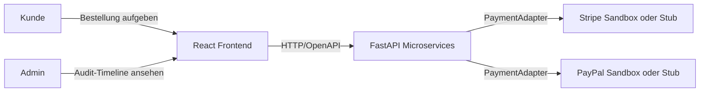
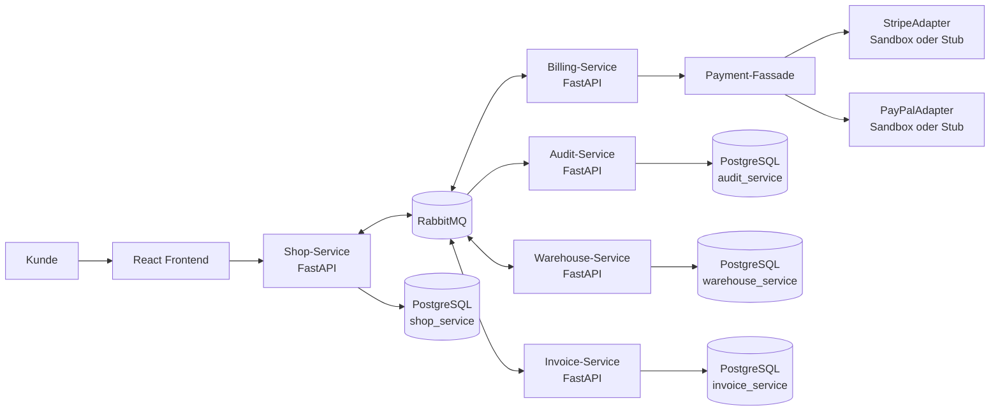
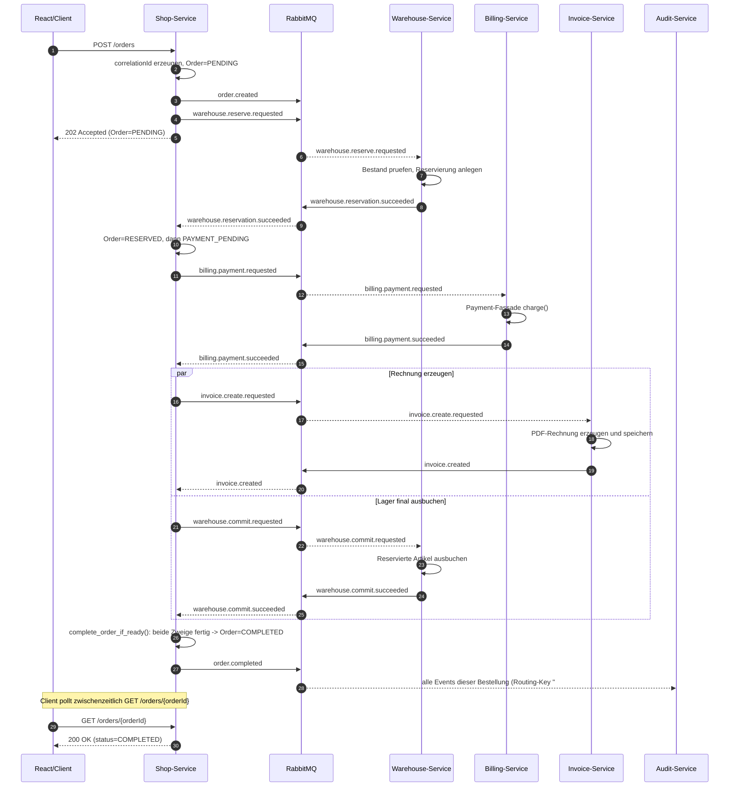
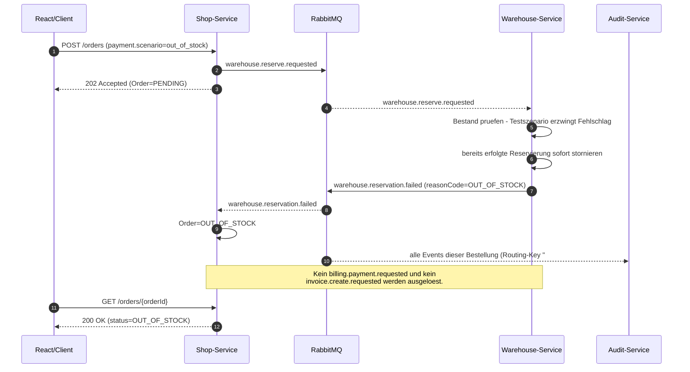
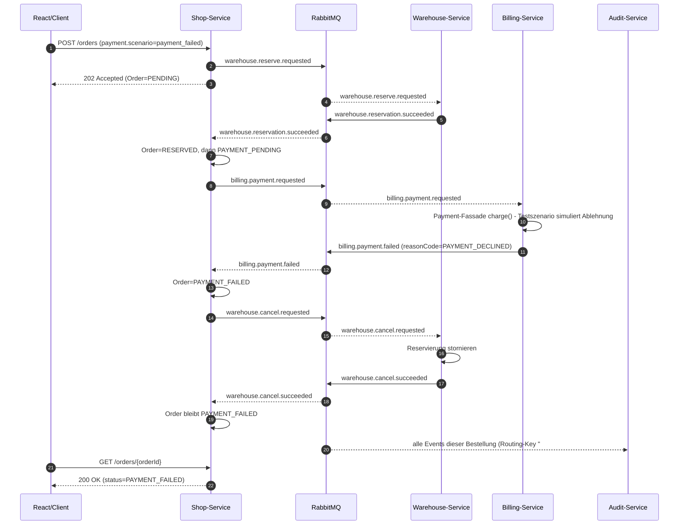
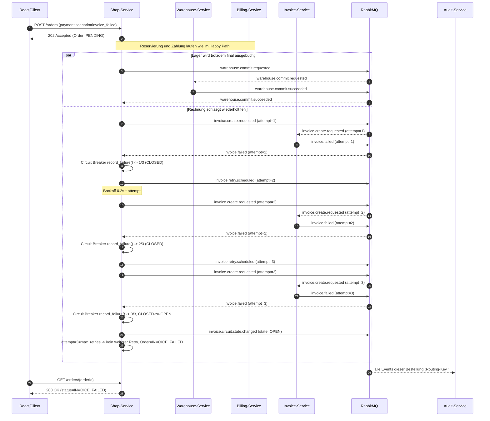
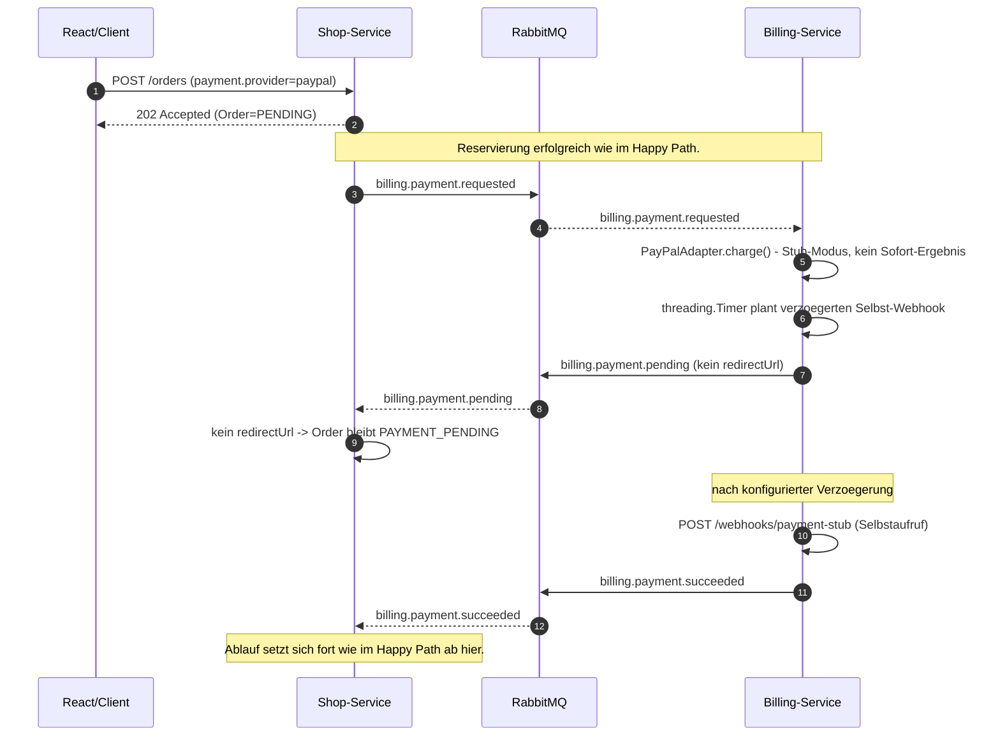

# Architektur: Microservice-orientierter Online-Shop

## 1. Zielbild

Das System simuliert den Bestellprozess eines Online-Shops mit klar getrennten
Microservices. Die Umsetzung nutzt Python/FastAPI fuer die Backend-Services,
React fuer Shop und Admin-Dashboard, PostgreSQL fuer Persistenz, RabbitMQ
fuer interne Service-Kommunikation und Docker Compose fuer das lokale Deployment.

Die interne Kommunikation erfolgt event- und command-basiert ueber RabbitMQ.
Diese Entscheidung ist in
`docs/decisions/002-rabbitmq-for-service-communication.md` begruendet.

## 2. Systemkontext

_Quelldatei: [`docs/diagrams/systemkontext.mmd`](diagrams/systemkontext.mmd)_



## 3. Komponenten

_Quelldatei: [`docs/diagrams/komponenten.mmd`](diagrams/komponenten.mmd)_



Billing-Service ist zustandslos und hat bewusst keine eigene Datenbank: er
haelt keinen Zahlungsstatus vor, sondern liest ihn bei Bedarf direkt beim
Zahlungsanbieter (Stripe/PayPal) aus (siehe `getStatus()` in der
Payment-Fassade).

### Verantwortlichkeiten

| Komponente | Verantwortlichkeit |
| --- | --- |
| React Frontend | Externe UI fuer Bestellung und Admin-Dashboard |
| Shop-Service | Externe Order API, Produktkatalog, correlationId, Order-Status, Saga-Orchestrierung; DB `shop_service` |
| Warehouse-Service | Bestand verwalten, Reservierung anlegen, stornieren und final ausbuchen; DB `warehouse_service` |
| Billing-Service | Zahlungsfluss, Payment-Fassade, Checkout-Sessions, Refunds; zustandslos, keine eigene DB |
| Invoice-Service | Je Command ein PDF-Erstellungsversuch und persistente Invoice-Metadaten; DB `invoice_service` |
| Audit-Service | Unveraenderliche Audit-Snapshots chronologisch bereitstellen; DB `audit_service` |
| RabbitMQ | Commands und Domain-Events zwischen Services |
| PostgreSQL | Persistenz pro Service, mindestens Audit-Snapshot-Speicher |

## 4. Kommunikationsmodell

Externe Clients sprechen REST/OpenAPI mit dem Shop-Service und Audit-Service.
Interne Service-Kommunikation laeuft ueber RabbitMQ. Commands fordern Arbeit an,
Events beschreiben ein bereits eingetretenes Ergebnis.

Bestandsveraendernde Warehouse-Aktionen laufen ueber RabbitMQ. Fuer die
kundenseitige Produktanzeige stellt der Warehouse-Service zusaetzlich den
Read-Endpoint `GET /stock` bereit; der Shop-Service reichert damit seinen
Produktkatalog um `availableQuantity` an.

### Warehouse-Management

Der Warehouse-Service persistiert Bestandsdaten in PostgreSQL:

- `warehouse_stock`: Gesamtbestand, reservierte Menge, verfuegbare Menge und Lagerort pro Produkt
- `warehouse_reservations`: Reservierung je Bestellung mit Status `RESERVED`, `COMMITTED` oder `CANCELLED`

Bei `warehouse.reserve.requested` prueft der Service innerhalb einer
Datenbanktransaktion, ob alle Artikel ausreichend verfuegbar sind. Erfolgreiche
Reservierungen erhoehen `reserved_quantity`; die Ware ist dadurch fuer andere
Bestellungen nicht mehr verfuegbar. Bei fehlendem Bestand wird
`warehouse.reservation.failed` mit `OUT_OF_STOCK` publiziert.

Bei erfolgreicher Zahlung sendet der Shop-Service `warehouse.commit.requested`.
Der Warehouse-Service reduziert dann `quantity_on_hand` und `reserved_quantity`
und publiziert `warehouse.commit.succeeded`. Schlaegt die Zahlung fehl, wird per
`warehouse.cancel.requested` nur die Reservierung geloest.

Alle Messages verwenden ein gemeinsames Envelope:

```json
{
  "messageId": "3ed57c11-faa8-4e8e-bb4c-4c7c1e6cbb7b",
  "correlationId": "65c40581-4e0d-4a7f-8e9e-0c79fe412c73",
  "type": "billing.payment.succeeded",
  "sourceService": "billing-service",
  "timestamp": "2026-07-07T15:30:00Z",
  "payload": {},
  "previousEventId": "0f394842-96e6-48d8-a4fe-7d0a2a49b17c"
}
```

Die verbindlichen Routing Keys sind in `docs/event-contracts.md` dokumentiert.

## 5. Happy-Path-Sequenz

_Quelldatei: [`docs/diagrams/sequenz-happy-path.mmd`](diagrams/sequenz-happy-path.mmd)_

Wichtig fuer das Lesen aller Sequenzdiagramme in diesem Abschnitt: `POST
/orders` antwortet **immer sofort** mit `202 Accepted` (Order=`PENDING`),
noch bevor irgendein RabbitMQ-Schritt der Saga verarbeitet wurde. Die
gesamte weitere Verarbeitung laeuft asynchron; der Client erfaehrt den
tatsaechlichen Endstatus erst durch spaeteres Polling von `GET
/orders/{orderId}` (oder durch die SSE-Echtzeit-Updates im
Admin-Dashboard). Eine synchrone Endantwort erfolgt nicht.



## 6. Fehlerszenarien

Die Choreografie kennt vier relevante Abweichungen vom Happy Path, die
sich fachlich deutlich unterscheiden: ein Szenario bricht bereits im
ersten Schritt ab (6.1), eines kompensiert eine bereits erfolgte
Reservierung (6.2), eines rollt eine bereits erfolgreiche Zahlung wieder
zurueck (6.3), und eines ist genau genommen kein Fehler, sondern eine
verzoegerte Erfolgsmeldung (6.4).

### 6.1 Lager nicht verfuegbar

_Quelldatei: [`docs/diagrams/sequenz-fehlerszenario-lager-nicht-verfuegbar.mmd`](diagrams/sequenz-fehlerszenario-lager-nicht-verfuegbar.mmd)_



### 6.2 Zahlung abgelehnt

_Quelldatei: [`docs/diagrams/sequenz-fehlerszenario-zahlung-abgelehnt.mmd`](diagrams/sequenz-fehlerszenario-zahlung-abgelehnt.mmd)_



### 6.3 Invoice-Service nicht erreichbar (Retry und Circuit Breaker)

_Quelldatei: [`docs/diagrams/sequenz-fehlerszenario-rechnung-fehlgeschlagen.mmd`](diagrams/sequenz-fehlerszenario-rechnung-fehlgeschlagen.mmd)_

Einziges Szenario ohne Rollback von Zahlung/Lager: beide sind bereits
abgeschlossen, bevor die Rechnung wiederholt fehlschlaegt (siehe
Begleittext in Kapitel 2 der Pruefungsvorbereitung bzw. Abschnitt 9 hier).



### 6.4 Asynchrone Zahlung (PayPal-Webhook)

_Quelldatei: [`docs/diagrams/sequenz-fehlerszenario-asynchrone-zahlung.mmd`](diagrams/sequenz-fehlerszenario-asynchrone-zahlung.mmd)_

Genau genommen kein Fehlerszenario, sondern der Regelfall bei PayPal: die
Fassade liefert nie ein Sofort-Ergebnis, sondern `PENDING`, und das
eigentliche Ergebnis kommt erst per (hier simuliertem) Webhook-Callback
zurueck.



## 7. Payment-Fassade

Der Billing-Service kapselt alle Zahlungsanbieter hinter einer gemeinsamen
Fassade. Der Billing-Kern arbeitet nur mit eigenen Domaenentypen und kennt keine
anbieter-spezifischen Payloads. Stripe und PayPal koennen gegen echte Sandboxen
laufen, fallen ohne Credentials aber auf lokale Stub-Antworten zurueck.

Pflichtoperationen:

- `charge(orderId, amount, currency)`
- `refund(transactionId, amount)`
- `getStatus(transactionId)`

Anbieter:

- `StripeAdapter` - mit `STRIPE_SECRET_KEY` immer asynchron per Redirect zu
  einer echten Stripe Checkout Session; ohne Key sofortiger lokaler Stub.
- `PayPalAdapter` - mit Credentials immer asynchron per Redirect zur echten
  PayPal-Freigabeseite; ohne Credentials Stub mit simuliertem Webhook
  (siehe unten).

Der aktive Anbieter wird per Konfiguration gesetzt, zum Beispiel
`PAYMENT_PROVIDER=stripe` oder `PAYMENT_PROVIDER=paypal`.

Adapter registrieren sich automatisch ueber die Basisklasse `PaymentAdapter`.
Ein weiterer Anbieter wird als neue Adapterklasse mit eigenem `provider_name`
hinzugefuegt; die Fassade selbst muss dafuer nicht geaendert werden.

### Echter Redirect vs. simulierter Webhook

Mit Sandbox-Credentials liefert `charge()` bei beiden Anbietern nie sofort ein
Endergebnis, sondern immer `PaymentStatus.PENDING` mit einer echten
`redirect_url` (Stripe Checkout Session bzw. PayPal-Freigabeseite). Der Ablauf
ist fuer beide Anbieter identisch:

- Billing-Service publiziert `billing.payment.pending` mit `redirectUrl`;
  Shop-Service setzt die Order auf `PAYMENT_ACTION_REQUIRED` und liefert die
  URL ueber `GET /orders/{orderId}` aus. Das Frontend leitet den Browser
  dorthin weiter.
- Nach Rueckkehr ruft das Frontend `POST /orders/{orderId}/payment-confirmation`
  bei Shop-Service auf; dieser publiziert `billing.payment.confirm.requested`,
  worauf Billing-Service ueber die Fassade `getStatus()` aufruft -
  `get_status()` fuehrt dabei den echten Capture (PayPal) bzw. die
  Session-Pruefung (Stripe) aus und liefert SUCCEEDED/FAILED.

**Nur PayPal** simuliert diesen Ablauf zusaetzlich als Stub, wenn keine
Credentials gesetzt sind: `charge()` liefert
PENDING, nach der konfigurierbaren Verzoegerung `ASYNC_PAYMENT_WEBHOOK_DELAY_SECONDS`
sendet der Stub sich selbst einen Webhook an `POST /webhooks/payment-stub`.
Stripe bleibt ohne Credentials ein einfacher, sofort erfolgreicher Stub.
Der Webhook wird von Billing-Service in das bestehende RabbitMQ-Event
`billing.payment.succeeded` oder `billing.payment.failed` uebersetzt.

In beiden Faellen setzt der Shop-Service die Saga unveraendert ueber die
bestehenden Payment-Events fort (Invoice-Anforderung, Warehouse-Commit, ggf.
Refund-Kompensation).

Fuer Tests kann das finale Stub-Ergebnis im Payment-Payload ueber
`webhookStatus=SUCCEEDED` oder `webhookStatus=FAILED` gesteuert werden.

### API- und Fehlerkonventionen

Alle Services liefern technische Fehler als RFC-7807-kompatible
`application/problem+json`-Antworten. Die Antwort enthaelt `type`, `title`,
`status`, `detail`, `instance` und die aktuelle `correlationId`.

### Idempotenz fuer POST /orders

Der Shop-Service unterstuetzt den Header `Idempotency-Key` fuer `POST /orders`.
Der erste Request speichert Key und Hash des kanonischen Request-Bodys in der
Tabelle `shop_orders`. Wiederholt ein Client denselben Request mit identischem
Key, liefert der Shop-Service dieselbe `OrderResponse` zurueck und publiziert
keine weiteren RabbitMQ-Commands. Wird derselbe Key mit einem anderen Body
verwendet, antwortet der Service mit `409 Conflict`.

### Logging

Alle Services schreiben strukturierte JSON-Logs auf die Konsole und in taeglich
rotierende Log-Dateien unter `logs/<service>.log`. Die Aufbewahrung ist auf 14
Tage konfiguriert.

Zusaetzlich wird ein zentraler Loki/Grafana-Stack per Docker Compose
ausgeliefert. Promtail liest die Docker-Logs aller Container, extrahiert die
JSON-Felder `service`, `level`, `correlationId`, `eventType`, `paymentResult`,
`provider` und `reasonCode` und sendet sie an Loki. Grafana ist unter
`http://localhost:3001` erreichbar und laedt automatisch das Dashboard
`Webshop Zentrales Log-Management`.

Das Dashboard zeigt:

- Anzahl der Bestellungen pro Zeitintervall anhand von `eventType=order.accepted`
- Fehlerrate nach Service anhand von `level=ERROR`
- Zahlungsversuche nach Ergebnis anhand von `paymentResult=SUCCEEDED`,
  `DECLINED` oder `TIMEOUT`

### Invoice-Retry und PDF-Rechnungen

Der Invoice-Service erzeugt PDF-Rechnungen im Retro-Design als echte PDF-Dateien
und speichert Metadaten in der Tabelle `invoices`. Pro
`invoice.create.requested` fuehrt er genau einen Versuch aus und meldet einen
Fehler mit `invoice.failed`. Der Shop-Service plant anhand von Versuchszahl und
Circuit-Breaker-Zustand bis zu zwei weitere Versuche und publiziert dafuer
`invoice.retry.scheduled`. Nach dem letzten Fehlschlag setzt er die Bestellung
auf `INVOICE_FAILED`.

### Circuit Breaker fuer den Invoice-Service

Der Shop-Service schuetzt den Aufruf des Invoice-Service mit einem eigenen
Circuit Breaker. Nach drei aufeinanderfolgenden `invoice.failed`-Ereignissen
wechselt der Circuit nach `OPEN`; neue `invoice.create.requested`-Commands
werden dann nicht mehr an den Invoice-Service gesendet. Nach 30 Sekunden erlaubt
der Circuit automatisch den naechsten Testaufruf im Zustand `HALF_OPEN`. Ein
erfolgreiches `invoice.created` schliesst den Circuit wieder, ein erneutes
`invoice.failed` oeffnet ihn erneut.

Jeder Zustandswechsel wird als `invoice.circuit.state.changed` veroeffentlicht
und dadurch vom Audit-Service als Snapshot persistiert.

## 8. Audit-Snapshots

Jeder relevante Zustandsuebergang erzeugt ein Audit-Event. Der Audit-Service
persistiert daraus unveraenderliche Snapshots in PostgreSQL.

Mindestfelder:

| Feld | Typ | Bedeutung |
| --- | --- | --- |
| correlationId | UUID | Verbindet alle Snapshots einer Bestellung |
| eventType | String | Fachliches Ereignis, z. B. `PAYMENT_FAILED` |
| service | String | Ursprung des Events |
| timestamp | Timestamp UTC | Zeitpunkt des Ereignisses |
| payload | JSON | Relevanter Zustand zum Zeitpunkt des Events |
| previousEventId | UUID/null | Verkettung zum vorherigen Snapshot |
| actor | String | Systemkomponente oder Benutzer |
| statusCode | String | `SUCCESS`, `FAILURE`, `RETRY`, `COMPENSATING`, `COMPENSATED` |

Snapshots werden nur eingefuegt. Updates und Deletes sind fuer die
Snapshot-Tabelle fachlich verboten.

## 9. Erweiterbarkeitsanalyse: vierter Zahlungsanbieter

Ein weiterer Zahlungsanbieter wird hinzugefuegt, indem ein neuer Adapter im
Billing-Service implementiert wird, der das bestehende Payment-Facade-Interface
erfuellt und einen eindeutigen `provider_name` setzt. Die Basisklasse
registriert den Adapter automatisch; der Anbieter ist anschliessend per
`PAYMENT_PROVIDER` aktivierbar.

Zu aendern:

- Neuer Adapter, z. B. `billing-service/src/payment/adyen_adapter.py`
- Optional Konfiguration fuer externe Credentials
- Tests fuer Erfolg, Ablehnung und Timeout des neuen Anbieters

Nicht zu aendern:

- Saga-Orchestrierung im Shop-Service
- RabbitMQ-Command- und Event-Vertraege
- Externe Shop- und Audit-APIs
- Payment-Fassade und Billing-Kernlogik, sofern sie nur gegen die Fassade programmiert

## 10. Kommunikationsentscheidung

Das Projekt nutzt fuer die interne Kommunikation konsequent RabbitMQ. Dadurch
werden Saga-Schritte, Kompensation und Audit-Snapshots einheitlich ueber Commands
und Events abgebildet. REST bleibt auf externe APIs und gezielte Lesezugriffe
beschraenkt.
